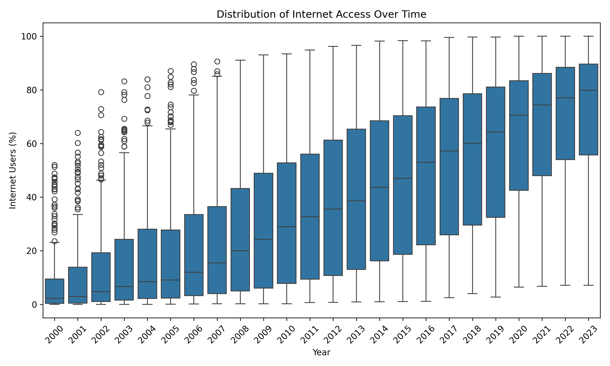
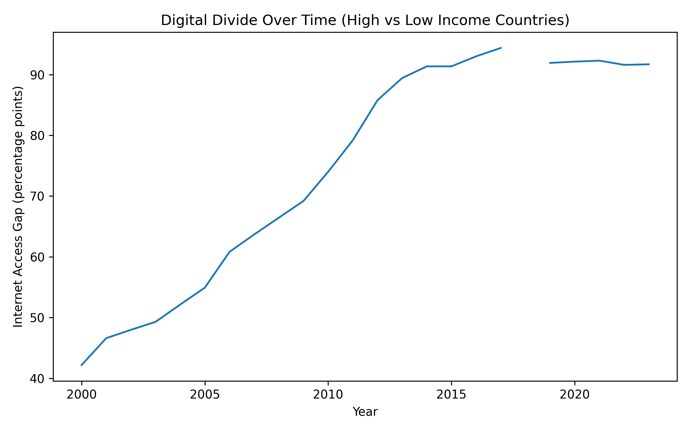
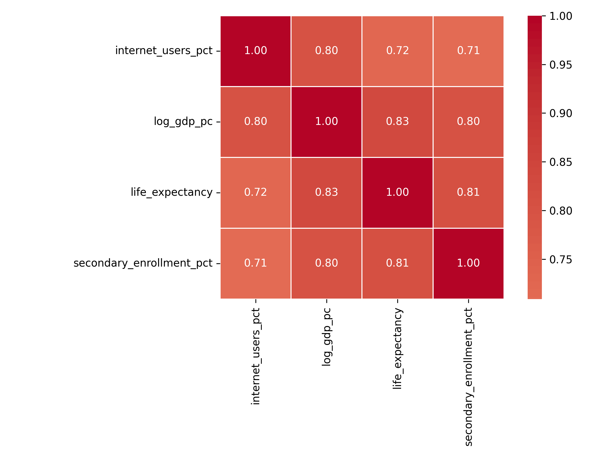
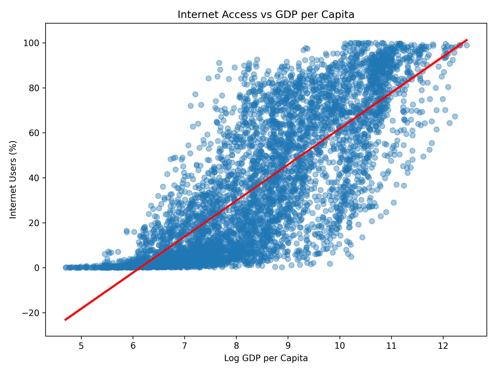
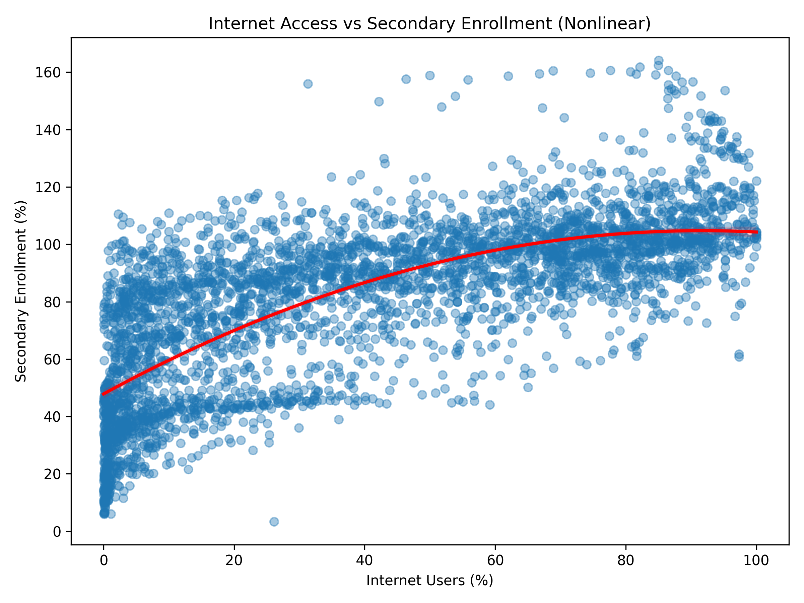
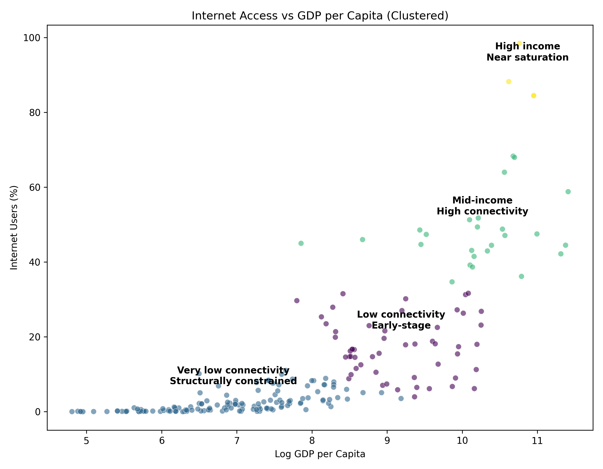

# Results
{: .fs-8 }

Findings across four progressive model specifications
{: .fs-5 .fw-300 }

---

{: .highlight }
> Results are presented in the order the models were estimated — from simple correlations to progressively more controlled specifications. Each step adds a layer of rigor and sharpens the interpretation. Read the [Methods](methods) page for full model specifications and justification.

---

## 1. Exploratory Analysis: The Omitted Variable Problem

The first step is establishing the raw associations between internet penetration and development outcomes — and making explicit the confounding threat they present.

### Global Internet Penetration

The map below shows internet penetration rates by country for the most recent available year. The geographic concentration of low connectivity in Sub-Saharan Africa and parts of South Asia is immediately visible, as is the near-universal coverage across North America, Western Europe, and East Asia.

<iframe src="assets/images/internet_map.html" width="100%" height="450px" frameborder="0" scrolling="no"></iframe>
*Figure 1. Internet users as a percentage of population, most recent available year. Hover over a country for details. Source: World Bank WDI.*

---

### The Distribution of Connectivity Over Time

The box plots below show how the global distribution of internet penetration has shifted from 2000 to 2023. The median has risen substantially, but the spread has also widened — the upper quartile has pulled far ahead while the lower quartile remains compressed near zero.

*Figure 2. Distribution of internet users (% of population) across countries by year, 2000–2023. Each box shows the interquartile range; whiskers extend to 1.5× IQR. Source: World Bank WDI.*

---

### The Digital Divide Is Growing

The widening spread in Figure 2 is not random — it is driven by a systematic divergence between high- and low-income countries. The chart below shows the percentage point gap in internet penetration between high-income and low-income countries over time.

*Figure 3. Percentage point difference in mean internet penetration between high-income and low-income countries, 2000–2023. Source: World Bank WDI.*

The gap has grown consistently across the entire study period. High-income countries entered the 2000s with a connectivity advantage and compounded it — accelerating through mobile internet adoption while low-income countries remained constrained by infrastructure and affordability. This divergence is the empirical backdrop for the regression analysis: understanding whether connectivity *causes* better outcomes, or merely reflects underlying wealth, is essential before drawing policy conclusions from these trends.

---

### Correlation Structure

The correlation matrix below confirms that internet penetration, GDP per capita, life expectancy, and secondary enrollment are all strongly positively associated with one another.

*Figure 4. Pearson correlation matrix for internet penetration, log GDP per capita, life expectancy, and secondary enrollment. Source: World Bank WDI.*

Internet penetration correlates at **r = 0.80** with log GDP per capita, **r = 0.71** with secondary enrollment, and **r = 0.72** with life expectancy. GDP per capita and life expectancy correlate at **r = 0.83**.

These patterns confirm the central empirical challenge: internet access, income, education, and health are so deeply intertwined that any single-variable regression would conflate the effect of connectivity with the general effect of being a wealthy, well-developed country. **All subsequent models control for log GDP per capita.**

---

### Internet Access and GDP

Before modeling, it is useful to see the raw bivariate relationship between internet access and income.

*Figure 5. Internet users (% of population) vs. log GDP per capita, all country-year observations. Linear regression line shown. Source: World Bank WDI.*

The strong positive slope confirms the omitted variable concern. A naive regression of any development outcome on internet access — without controlling for income — would largely be picking up this relationship.

---

## 2. Baseline OLS: Isolating the Independent Effect

**Model:** `secondary_enrollment ~ internet_users_pct + log_gdp_pc`

| | Coefficient | Std. Error | p-value |
|---|---|---|---|
| Internet users (%) | **0.17** | 0.01 | < 0.001 |
| Log GDP per capita | **~12** | 0.30 | < 0.001 |
| R² | 0.65 | | |
| N | 3,824 | | |

{: .note }
**Interpretation.** A 1 percentage point increase in internet penetration is associated with a **+0.17 pp increase in secondary enrollment**, controlling for income. A one-unit increase in log GDP per capita — roughly a 2.7× increase in income — is associated with a **+12 pp increase** in enrollment. Both coefficients are statistically significant.

The most important takeaway is the *relative magnitudes*. The internet coefficient is positive and significant, but it is more than 70 times smaller than the GDP coefficient. Economic development is the dominant structural predictor of educational attainment. Internet access contributes, but it operates within — and is heavily conditioned by — the broader economic environment.

The scatter plot below shows the internet–enrollment relationship directly. The nonlinear fit visible in the regression line motivates the quadratic specification in Model 4.

*Figure 6. Internet users (% of population) vs. secondary school enrollment (gross %), all country-year observations. Nonlinear regression line shown. Source: World Bank WDI.*

---

## 3. Interaction Model: Do Returns Vary by Income?

**Model:** `secondary_enrollment ~ internet_users_pct + log_gdp_pc + (internet × log_gdp) + year_fixed_effects`

| | Coefficient | Std. Error | p-value |
|---|---|---|---|
| Internet users (%) | **1.58** | 0.06 | < 0.001 |
| Log GDP per capita | **13.78** | 0.38 | < 0.001 |
| Internet × log GDP | **−0.13** | 0.00 | < 0.001 |
| Year FEs | Included | | |
| R² | 0.70 | | |
| N | 3,824 | | |

{: .note }
**Interpretation.** The positive coefficient on internet access (1.58) shows that, holding GDP and global time trends constant, higher internet penetration is associated with substantially higher secondary enrollment. The negative interaction term (−0.130) is the central finding: **the marginal effect of internet access on education declines as GDP increases.**

At low income levels (log GDP ≈ 7, roughly $1,100 per capita), an additional percentage point of internet penetration is associated with approximately +0.67 pp more enrollment. At high income levels (log GDP ≈ 11, roughly $60,000 per capita), the same increase yields only +0.17 pp. **The returns are four times larger in poorer countries than in richer ones.**

Year fixed effects absorb all global shocks common to a given year — the 2008 financial crisis, the COVID-19 pandemic, the global expansion of mobile broadband — ensuring that the estimated coefficients reflect variation *across countries within the same year*, not shared global time trends.

---

## 4. Within-Country Model: Health Outcomes

**Model:** `Δlife_expectancy ~ Δinternet_users_pct + year_fixed_effects`

| | Coefficient | Std. Error | p-value |
|---|---|---|---|
| Δ Internet users (%) | **0.0265** | 0.00 | < 0.001 |
| Year FEs | Included | | |
| R² | 0.13 | | |
| N | 3,602 | | |

{: .note }
**Interpretation.** A 1 percentage point increase in internet penetration within a country in a given year is associated with a **+0.027-year increase in life expectancy**, after removing time-invariant country characteristics and controlling for global year shocks.

This is the most credibly causal estimate in the analysis. By differencing within countries, the model removes all fixed country characteristics — geography, colonial history, long-run institutional quality, baseline health system capacity — that are correlated with both internet investment decisions and health outcomes. What remains is year-over-year variation *within* each country, net of global trends.

The coefficient is small in absolute terms: a 10 pp increase in internet penetration is associated with approximately one-quarter of a year of additional life expectancy. But it is statistically significant and directionally consistent with a story in which digital connectivity enables better access to health information, telemedicine, and public health communication.

---

## 5. Nonlinear Model: Diminishing Returns

**Model:** `secondary_enrollment ~ internet_users_pct + internet_users_pct² + log_gdp_pc + year_fixed_effects`

| | Coefficient | Std. Error | p-value |
|---|---|---|---|
| Internet users (%) | **0.90** | 0.04 | < 0.001 |
| Internet users (%)² | **−0.01** | 0.00 | < 0.001 |
| Log GDP per capita | **9.15** | 0.37 | < 0.001 |
| Year FEs | Included | | |
| R² | 0.68 | | |
| N | 3,824 | | |

{: .note }
**Interpretation.** The significant negative quadratic coefficient confirms a **concave relationship**: the marginal effect of internet penetration on secondary enrollment is positive but decreasing. The turning point — where marginal returns approach zero — is at approximately **79% penetration** (= 0.90 / (2 × 0.0057)), with the curve flattening substantially around **60–70%**, the practical saturation zone for policy purposes.

For a country at 10% penetration, an additional percentage point of internet access is associated with approximately +0.79 pp of secondary enrollment. For a country at 60%, the same increase yields only +0.22 pp. For a country at 80%+, the marginal return is near zero. There is a *structural nonlinearity* in the relationship such that early movers up the connectivity distribution capture disproportionate gains.

---

## 6. Investment Clustering

Countries are grouped using K-means clustering on six features derived from the regression analysis, applied to each country's earliest available observation to capture its *baseline* position on the returns curve. The map below shows cluster assignments geographically.

<iframe src="assets/images/internet_map_clustered.html" width="100%" height="450px" frameborder="0" scrolling="no"></iframe>
*Figure 7. Country cluster assignments from K-means analysis. Hover over a country for details. Source: World Bank WDI, authors' analysis.*

The scatter plot below shows how clusters separate in the internet penetration × GDP space — the two dimensions that most directly determine a country's position on the returns curve.

*Figure 8. Internet users (% of population) vs. log GDP per capita, colored by investment cluster. Source: World Bank WDI, authors' analysis.*

### Cluster Profiles

| Cluster | N Countries | Internet (%) | Log GDP | Sec. Enrollment (%) | Life Exp. |
|---|---|---|---|---|---|
| **0** — Primary target | 53 | 17.2 | 9.14 | 93.4 | 74.5 |
| **1** — Constrained | 140 | 2.4 | 6.90 | 51.2 | 62.4 |
| **2** — Secondary target | 25 | 47.8 | 10.22 | 102.3 | 77.8 |
| **3** — Saturated | 4 | 88.9 | 10.82 | 117.5 | 82.8 |

### Cluster 0 — Primary Investment Target

Countries in this cluster have moderate income (log GDP ≈ 9.14, roughly $9,000–12,000 per capita), low internet penetration (mean 17.2%), and strong human capital baseline metrics — secondary enrollment averages 93.4% and life expectancy 74.5 years. The gap to the 50% connectivity benchmark averages 32.8 percentage points.

This combination is the most favorable profile for high-return connectivity investment. These economies have sufficient institutional capacity and existing human capital infrastructure to absorb digital investment effectively, are positioned on the steepest part of the nonlinear returns curve, and unlike Cluster 1, are not so income-constrained that foundational development preconditions are absent.

Top investment candidates within Cluster 0, ranked by estimated marginal return:

| Country | ISO3 | Internet (%) | Marginal Return Proxy |
|---|---|---|---|
| Barbados | BRB | 3.97 | 0.857 |
| St. Kitts & Nevis | KNA | 5.86 | 0.835 |
| Bahrain | BHR | 6.15 | 0.832 |
| Qatar | QAT | 6.17 | 0.832 |
| Antigua & Barbuda | ATG | 6.48 | 0.828 |
| Kuwait | KWT | 6.73 | 0.825 |
| Argentina | ARG | 7.04 | 0.822 |
| Seychelles | SYC | 7.40 | 0.818 |
| Dominica | DMA | 8.81 | 0.802 |
| Brunei | BRN | 8.99 | 0.800 |

### Cluster 1 — Foundational Investment Needed

The most structurally constrained group: very low internet penetration (mean 2.4%), very low income (log GDP ≈ 6.90, roughly $1,000 per capita), weak secondary enrollment (51.2%), and low life expectancy (62.4 years). The connectivity gap to 50% penetration averages 47.6 pp.

Internet infrastructure alone is unlikely to generate large gains in these settings. Standalone broadband programs without complementary investments in schools, health systems, and economic development are likely to underperform. **Connectivity investment in Cluster 1 should be part of integrated development programs, not standalone initiatives.**

### Cluster 2 — Secondary Target

Mid-income countries (log GDP ≈ 10.22) with internet penetration averaging 47.8% — close to the 50% threshold identified in the quadratic model as the beginning of the diminishing returns zone. Human capital indicators are strong (enrollment 102.3%, life expectancy 77.8 years). Targeted, efficiency-focused investments — particularly aimed at rural or low-income populations within these countries — can still generate meaningful returns. The policy frame here is **closing within-country gaps** rather than expanding national averages.

### Cluster 3 — Advanced Digital Policy

Fully saturated economies: internet penetration averaging 88.9%, high income (log GDP ≈ 10.82), and the strongest human capital outcomes in the sample. Additional basic connectivity investment yields near-zero marginal returns. The appropriate policy frame is advanced digital transformation — AI governance, digital public services, cybersecurity — not broadband expansion.

[View the Code →](data){: .btn .btn-primary .fs-5 .mb-4 .mb-md-0 .mr-2 }
[Read the Methods →](methods){: .btn .fs-5 .mb-4 .mb-md-0 }